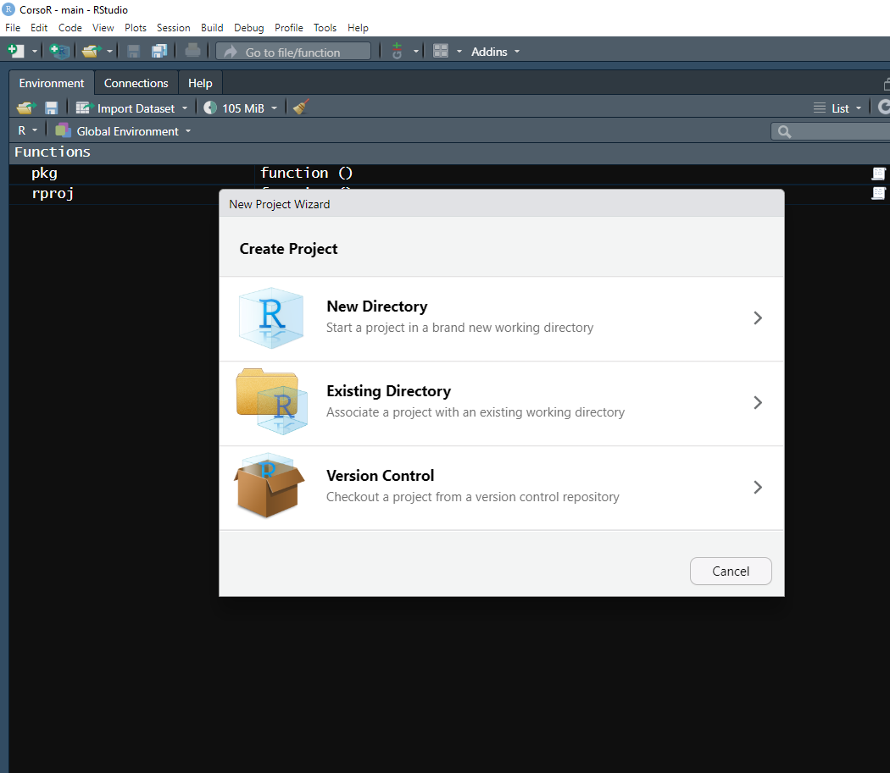
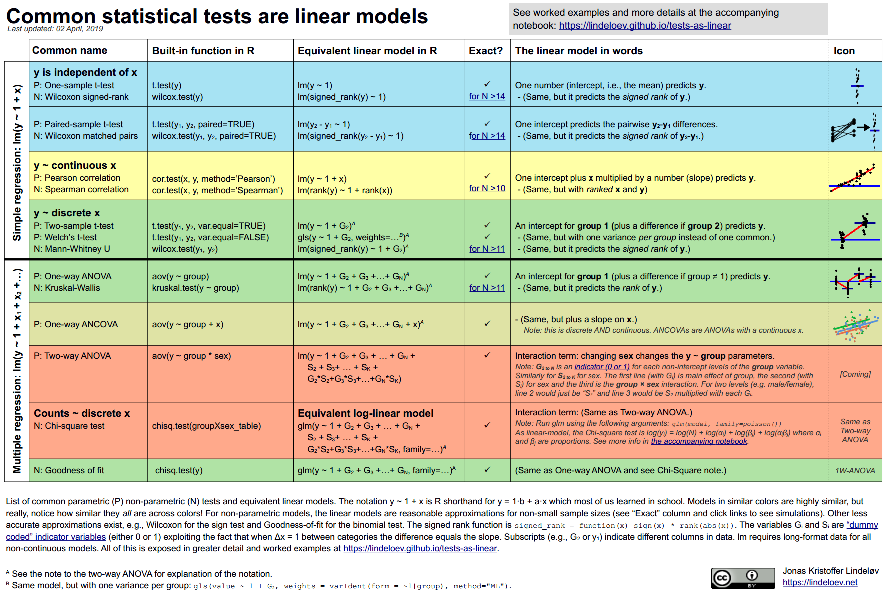

# Inizializzare un R project

## New Repository in Github


1 creare un nuovo repository in Github (github.com/NAME/)

2 copiare l'indirizzo url del repository 


## Creare un nuovo progetto in RStudio

1 Selezionare new Project



2 Scegliere "control version"


3 Copiare l'indirizzo del repository 


## Organizzare le cartelle del progetto

1 usare la funzione rproj() per creare le  seguenti cartelle:


```{r echo=FALSE, warning=FALSE}
library(fs)
dir_tree(path = "C:/Users/vito.tranquillo/Desktop/Git Projects/ProgettoR", recurse = TRUE)
```

## Organizzare le cartelle del progetto

 - R (qui si inseriscono i codici di R, la cartella contiene il file codiciOF.R e il file librerie.R). Il primo file si usa per scrivere lo script di R mentre nel secondo file c'è l'elenco delle librerie che devono essere caricate oltre e quelle che si caricano con la funzione pkg()
 - dati (qui si inseriscono i dati nei vari formati)
 - report (qui si inseriscono i file rmd per scirvere report, la cartella contiene già un file notebook.rmd per la scrittura di un report usando la funzioanlità notebook di rmarkdown)

## Organizzare le cartelle del progetto

usare la funzione pkg() per caricare le seguenti librerie:
 
 - tidyverse
 - readxl
 - openxlsx
 - gt
 - janitor
 - data.table
 - feather

# tidyverse

## Manipolare, analizzare e comunicare con il paradigma Tidyverse


## i dati devono essere tidy 


## pivot_wider()


## pivot_longer()


## pachetto dyplr 


## Split-Apply-Combine : group_by()


## pipe %>% 


## grafici con ggplot2


# Statistica con R

## statistical significant:don't say it and don't use it 




# Comunicazione (rmarkdown / quarto)


# Comunicazione (rmarkdown / quarto)


# Comunicazione (rmarkdown / quarto)


# Riproducibilità, archiviazione, controllo versioni


# github


# il ciclo di git


# scrittura collaborativa


