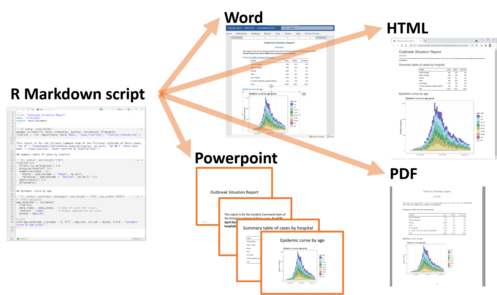

<br><br>

```{r echo=FALSE, message=FALSE, warning=FALSE}
library(here)
source(here('R', 'librerie.R'))
#library(learnr)
```

# Istruzioni iniziali

1.  Scaricare e installare i seguenti applicativi rispettando l'ordine d'installazione:

    a.  R (<https://cran.r-project.org/>)

    b.  Git (<https://git-scm.com/downloads>)

    c.  RStudio (<https://posit.co/download/rstudio-desktop/>)

2.  Creare un account personale su [GitHub] (<https://github.com/>)

3.  Installare i seguenti pacchetti che saranno utilizzati nel corso, copiando e incollando nella consolle di R questa istruzione:

```{r eval=FALSE}
install.packages(c("tidyverse", "readxl", "here", "janitor", "openxlsx", "gt", "knit", "rmarkdown"))

```

4.  Configurare il file .Rprofile

Usando il seguente comando 
```{r eval=FALSE}
file.edit("~/.Rprofile")
```
si aprirà il file .Rprofile in RStudio. Procedere copiando nel file le seguenti istruzioni

```{r eval=FALSE}
library(here)

#funzione che carica pacchetti di default
pkg <- function(){
  library(tidyverse)
  library(readxl)
  library(openxlsx)
  library(gt)
  library(janitor)
}

#funzione che inizializza un progetto
rproj <- function(){
  dir.create("R")
  dir.create("dati")
  dir.create("report")
  file.create(here("R", "codici.R"))
  file.create(here("report", "notebook.rmd"))
  fileConn<-file(here("report","notebook.rmd"))
  writeLines(c("---",
               "title: 'R Notebook'",
               "output: html_notebook",
               "---", 
               "",
               
               "```{r}",
               "source(here('R', 'librerie.R'))",
               
               "```",

               "# CAPITOLO",
               "## Paragrafo",
  
               "### Subparagrafo", 
               
               "#### Subsubparagrafo"), fileConn)
  close(fileConn)
  
  file.create(here("R", "librerie.R"))
  fileConn2<-file(here("R","librerie.R"))
  writeLines(c("library(tidyverse)", 
               "library(openxlsx)", 
               "library(readxl)"), fileConn2)
  close(fileConn2)
  
  fileConn3 <- file(here("R", "codici.R"))
  writeLines(c("source(here('R', 'librerie.R'))"), fileConn3)
  close(fileConn3)
  
}

```

Salvare e chiudere il file .Rprofile

Ora R è configurato in modo che ogni volta sarà aperto richiamerà la libreria "here" e renderà disponibile nell'ambiente globale la funzione rproj.R che potrà essere utilizzata per inizializzare nuovi progetti, come descritto nel prossimo paragrafo.

6.  Creare una cartella in Desktop denominata Rprogetti che ospiterà i progetti di R

## Inizializzare un nuovo progetto

I nuovi progetti vanno inizializzati dapprima nel repository github e poi clonati sul PC locale.

Aprite il sito GitHub e accedete con login e pwd. Cliccate su "New Repository". Proseguite dando un nome al repository seguendo i suggerimenti. Scrivete una piccola descrizione dei contenuti del progetto. Selezionate "Private" per rendere privato il contenuto del repository ( questa scelta influenzerà l'eventuale attività di scrittura collaborativa, ma potrà essere modificata anche in un secondo tempo a seconda delle necessità). Mettete la spunta su "ADD a Readme file". Concludete l'operazione cliccando sul pulsante verde "Create repository".

A questo punto avete creato un contenitore vuoto che ospiterà in seguito i file del progetto di cui volete garantire il controllo delle versioni, il costante aggioranamento e una sicura archivazione nel cloud.

## Clonare il progetto dal repository di GitHub nel PC locale

Copiate dalla barra degli indirizzi della pagina del nuovo repository l'indirizzo web che dovrebbe avere questa forma: https://github.com/Utente/Progetto.


<!-- [**https://github.com/Utente/Progetto**](https://github.com/Utente/Progetto){.uri}.  -->

Aprite RStudio e create un nuvo progetto utilizzando il comando New Project dal menu a tendina File. Scegliete l'opzione Version Control nella finestra di Dialogo dei nuovi progetti e quindi l'opzione Git. Incollate nella barra Repository URL l'indirizzo del repository del progetto precedentemente copiata. Nella barra Project directory name inserite il nome del Progetto e in Create project as subdirectory of: inserite il percorso della cartella Rprogetti presente nel desktop e che avete creato nel passo 6 delle istruzioni sopra. A questo punto cliccate il pulsante Create Project e R procederà a creare un nuova cartella in Rprogetti denominandola con il nome del progetto e all'interno clonerà i file presenti nel repository. Questa operazione si conclude con R che apre RStudio all'interno del nuovo progetto. Nel Pannello in basso a destra sotto la finestra file potrete visionare i file presenti nel progetto. In questa fase nella cartella del progetto non ci sono ancora le cartelle e i file tipici di un progetto R. Quindi eseguite la funzione rproj() semplicemnte scrivendo nella consolle di R l'istruzione rproj(). La funzione creerà nella cartella del progetto le seguenti cartelle:

-   R che contiene il file codiciOF.R in cui scrivere i codici di R, il file librerie.R con un elenco delle librerie di base da caricare

-   dati vuota, che ospiterà i dati del progetto

-   report che contiene il file notebook.rmd già con una configurazione di base per l'utilizzo come documento di reportistica dei risultati

# Programma del corso

## 1° Incontro  

### R, RSTUDIO e GIT
 
#### Argomenti trattati 

-   Panoramica su R e sulle funzionalità di RSTUDIO e GIT

-   Project in RStudio

-   Pacchetti di R

-   Concetti di base di R:

        - R base;  

        - enviroment; 

        - oggetti;  

        - vettori; 

        - liste; 

        - dataframe;

        - tipi di dati (character, double, numeric, factor, integer); 

        - cenni di programmazione funzionale


 


## 2° Incontro

### Gestione, manipolazione dei dati (data wrangling)

#### Introduzione al Tidyverse:


<!-- Tidyverse è una raccolta di pacchetti open source per il linguaggio di programmazione R introdotto da Hadley Wickham e dal suo team che "condividono una filosofia di progettazione sottostante, una grammatica e strutture di dati"  ordinati o "tidy".  -->

<!-- Tra principali pacchetti sono:  -->

<!-- dplyr, ggplot2, tidyr, tibble, readr, forecats, purr, stringr, lubridate -->

<!-- Il dettaglio dei singoli pacchetti, le funzionalità, le modalità d'uso sono ben descritte al sito di supporto del pacchetto a cui si rimanda (https://www.tidyverse.org/packages/) -->

<!-- In questo corso introduttivo e per le attività legate alla manipolazione, pulizia, dei dataset useremo principalmente il pacchetto dplyr e alcune funzioni del pacchetto  lubridate che permette la gestione delle date.  -->


<!-- **Tidy data** -->
<!-- I dati ordinati sono un modo per descrivere i dati organizzati con una particolare struttura – una struttura rettangolare, in cui ogni variabile ha la propria colonna, e ogni osservazione ha la sua riga ( Wickham 2014 ). -->

<!--  -->
<!-- Questa struttura standard di dati ordinati ha portato Hadley Wickham a descriverlo nel modo in cui Leo Tolstoy descrive le famiglie. Leo dice “ Le famiglie felici sono tutte uguali; ogni famiglia infelice è infelice a modo suo ”. Allo stesso modo, Hadley afferma che “ i set di dati ordinati sono tutti uguali, ma ogni set di dati disordinato è a suo modo disordinato ”. -->

<!--  -->
<!-- --- -->
<!-- ### Principali funzioni (verbi) per la manipolazione dei dati -->


<!-- ## Titanic -->

<!-- I dati contengono 12 variabili: numero di serie del passeggero ( PassengerId ), variabile di sopravvivenza del passeggero binario ( Survived ), classe di passeggeri (PClass ), nome (Name), genere ( , (Sex) età (Age), numero di fratelli e coniugi a bordo ( siblings and spouses on board ), numero di figli / genitori a bordo ( parent children on board ), numero di biglietto ( Tickett ), tariffa pagata (Fare), numero di cabina ( Cabin ) e lugo d'imbarco del passeggero ( Embarked). -->


<!-- # dyplr -->

<!-- ## Select -->
<!-- Il comando select() permette di selezionare una o più variabili del dataframe. Per selezionare alcune colonne è sufficiente aggiungere i nomi delle variabili come argomenti di select. L’ordine in cui vengono aggiunti, determinerà l’ordine in cui verranno visualizzati nell’output. -->


<!-- ## Mutate -->
<!-- È possibile creare nuove colonne utilizzando quelle del dataframe con la funzione mutate(). Le opzioni utilizzabili all’interno dell’istruzione sono quasi infinite: praticamente tutto ciò che si può fare per i vettori, può essere fatto all’interno della funzione mutate(). Solitamente per una nuova colonna si utilizza un nuovo nome ma se viene utilizzato il nome di una colonna già esistente essa viene sostituita. -->


<!-- ## Filter -->
<!-- In molti casi non si vogliono includere tutte le righe nell’analisi, ma solo una selezione. La funzione filter() riduce le righe/osservazioni in base alle condizioni assegnate, La sintassi generale del filtro è: filter(dataset, condizione). È possibile filtrare le variabili numeriche in base ai rispettivi valori. Gli operatori più utilizzati per questo sono: -->

<!-- 1 > (maggiore) -->

<!-- 2 >= (maggiore uguale) -->

<!-- 3 < (minore) -->

<!-- 4 <= (minore uguale) -->

<!-- 5 == (uguale) -->

<!-- 6 != (diverso) -->

<!-- Oppure per le variabile categoriche sono utilizzati i segni == o !=. Una o più condizioni possono essere usate contemporaneamente: -->

<!-- filter(iris, Species == "virginica", Sepal.Width > 3.7) -->

<!-- ## slice -->
<!-- La funzione slice() consente di selezionare le righe tramite la loro posizione: -->

<!-- slice(iris,8:12) -->

<!-- ## summarize -->
<!-- La funzione summarize() permette di calcolare funzioni statistiche riassuntive. Per utilizzare la funzione è sufficiente aggiungere il nome nuovo della colonna e, dopo il segno di uguale, la funzione matematica con cui vogliamo riassumere i dati column_name = funzione(variabile). È possibile aggiungere più funzioni di riepilogo all’interno dell’istruzione summarize(). -->

<!-- Il codice seguente mostra il calcolo della funzione mean e sd in riferimento alla variabile Sepal.Length: -->

<!-- summarize(iris, mean_sl = mean(Sepal.Length), sd_sl= sd(Sepal.Length )) -->

<!-- La funzione viene utilizzata in successione al comando **group_by()** come verrà spiegato nella sezione split-apply-combine. -->

<!-- ## Operatore PIPE: %>% -->

<!-- L’operatore pipe, **%>%** permette di concatenare facilmente una sequenza di funzioni. Quando la pipe è presente tra due funzioni esempio: fun1() %>% fun2() questa sequenza può essere tradotta con esegui fun1() poi, con con output di fun1(), esegui fun2(). Tale comando è mostrato nella sezione successiva in cui group_by() e summarize() sono usati in successione. Per richiamare l’operatore pipe dalla tastiera è possibile utilizzare la shortcut di RStudio: Ctrl + Shift + M (Windows), Cmd + Shift + M (Mac). -->


<!-- ## group_by  -->

<!-- Molte delle attività di analisi dati possono essere affrontate utilizzando il paradigma “split-apply-combine”: dividere i dati in gruppi, applicare alcune analisi a ciascun gruppo e combinare i risultati in un nuovo data frame. -->

<!-- Il pacchetto dplyr è stato scritto appositamente per ottimizzare le analisi di tipo Split-Apply-Combine. -->

<!--  -->


<!-- La funzione **group_by()** raggruppa i dati utilizzando i livelli di una variabile categorica ed è utilizzata insieme alla funzione summarize per fornire statistiche a riguardo i diversi gruppi. In questo esempio le funzioni sono concatenate con l’operatore %>%: -->


<!-- ## arrange -->

<!-- La funzione arrange() ordina le righe in modo crescente. Per ordinare in modo decrescente utilizzare la funzione desc() come mostrato nell’esempio: -->


<!-- ## join -->

<!-- Le funzioni join permettono di unire due tabelle tramite una o più  colonne in comune.  Quando si unisco due tabelle si definisce tabella di sinistra la prima tabella che viene codificata e tabella di destra la seconda. I nomi delle funzioni richiamano i respettivi comandi utilizzati in SQL. -->


<!-- left_join() : estrae tutti i valori della tabella a sinistra anche se non hanno corrispondenza nella tabella a destra; -->

<!-- right_join() estrae tutti i valori della tabella a destra anche se non hanno corrispondenza nella tabella di sinistra. -->

<!-- inner_join(): il suo scopo è quello di unire due tabelle restituendo un risultato combinato sulla base di uno o più osservazioni che trovano corrispondenza in tutte le tabelle coinvolte nella join. Il comando corrispondente è -->

<!-- full_join(): estrae tutte le righe delle due tabelle. -->


<!-- --- -->


## 3° Incontro

### Visualizzazione dei dati

#### grafici - ggplot2


#### tabelle - gt, flextable


## 4° Incontro  

### Statistica con R

**I test statistici sono modelli lineari**


### Riproducibilità della ricerca con R

-   reportistica con rmarkdown;
-   controllo versioni e lavoro collaborativo con GIT


